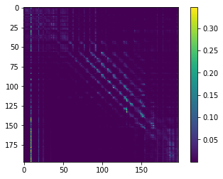
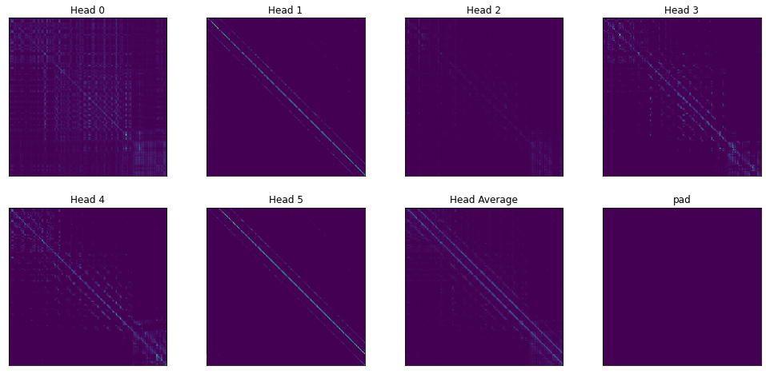
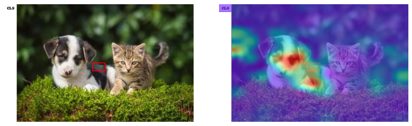

# transformer-visualizer

transformer-visualizer是一个辅助深度学习模型中Attention模块可视化的小工具，主要功能是帮助取出嵌套在模型深处的Attention Map

pytorch有个hook可以取出中间结果，需要进行如下类似的hook注册
```python
handle = net.conv2.register_forward_hook(hook)
```
这样操作的前提是我们知道要取出来的模块名，但是Transformer类模型一般是这样定义的(以Vit为例)
```python
class VisionTransformer(nn.Module):
    def __init__(self, *args, **kwargs):
        ...
        self.blocks = nn.Sequential(*[Block(...) for i in range(depth)])
        ...
```
然后每个`Block`中都有一个Attention
```python
class Block(nn.Module):
    def __init__(self, *args, **kwargs):
        ...
        self.attn = Attention(...)
        ...
```
如果要使用hooks其中的问题就是
1. 嵌套太深，模块名不清晰，我们根本不知道我们要取的attention map怎么以model.xx.yy.zz这样一直点出来！
2. 一般来说，Transformer中attention map每层都有一个，一个个注册实在太麻烦了

能否有更简洁的方法来得到Attention Map（尤其是Transformer的）？本工具就是，它具有以下特点
* 精准直接，你可以取出任何变量名的模型中间结果
* 快捷方便，同时取出Transformer类模型中的所有attention map
* 非侵入式，你无须修改函数内的任何一行代码
* 训练-测试一致，可视化完成后，你无须在训练时再将代码改回来

## 用法
### 安装
```shell
pip install bytecode
python setup.py install
```

安装完成后，只需要用get_local装饰一下Attention的函数，forward之后就可以拿到函数内与装饰器参数同名的局部变量啦~
### Usage1
比如说，我想要函数里的`attention_map`变量：
在模型文件里，我们这么写
```python
from visualizer import get_local

@get_local('attention_map')
def your_attention_function(*args, **kwargs):
    ...
    attention_map = ... 
    ...
    return ...
```
然后在可视化代码里，我们这么写
```python
from visualizer import get_local
get_local.activate() # 激活装饰器
from ... import model # 被装饰的模型一定要在装饰器激活之后导入！！

# load model and data
...
out = model(data)

cache = get_local.cache # ->  {'your_attention_function': [attention_map]}
```
最终就会以字典形式存在`get_local.cache`里，其中key是你的函数名,value就是一个存储attention_map的列表

### Usage2
使用Pytorch时我们往往会将模块定义成一个类，此时也是一样，只要装饰类中计算出attention_map的函数即可
```python
from visualizer import get_local

class Attention(nn.Module):
    def __init__(self):
        ...
    
    @get_local('attn_map')
    def forward(self, x):
        ...
        attn_map = ...
        ...
        return ...
```
其他细节请参考 notebooks/transformer-visualizer.ipynb 文件
## 代码组织结构

* timm: is a [library](https://huggingface.co/docs/timm/index) containing SOTA computer vision models, layers, utilities, optimizers, schedulers, data-loaders, augmentations, and training/evaluation scripts. forked from [pytorch-image-models](https://github.com/huggingface/pytorch-image-models/)

* transformers: is the standard implementation from huggingface. forked from [huggingface/transformers](https://github.com/huggingface/transformers/) 注：本项目主要用了它实现的BERT模型。

* visualizer: a tool to get intermediate results

## 可视化结果
这里是部分可视化vit_small的结果，全部内容在[notebooks/transformer-visualizer.ipynb](https://colab.research.google.com/drive/1PCytEiL8I0lYhH6Q2EIbQD5DAeIORDk9)文件里

因为普通Vit所有Attention map都是在Attention.forward中计算出来的，所以只要简单地装饰一下这个函数，我们就可以同时取出Vit中12层Transformer的所有Attention Map！

一个Head的结果



一层所有Heads的结果



某个grid的Attention Map



## 注意
* 想要可视化的变量在函数内部不能被后续的同名变量覆盖了，因为get_local取的是对应名称变量在函数中的**最终值**
* 进行可视化时，get_local.activate()一定要在导入模型**前**完成，因为python装饰器是在导入时执行的
* 训练时你不需要修改/删除任何代码，即不用删掉装饰函数的代码，因为在get_local.activate()没有执行的情况下，attention函数不会被装饰，故没有任何性能损失(同上一点，因为python装饰器是在导入时执行的)

## references
* [bytecode](https://blog.csdn.net/qfcy_/article/details/118890362)
